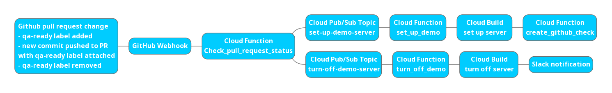

# Table of Contents
- [Table of Contents](#table-of-contents)
- [Description](#description)
- [Prerequisite](#prerequisite)
- [Usage](#usage)
- [Build Pipeline](#build-pipeline)
- [Code Structure](#code-structure)
  - [check-pull-request-status](#check-pull-request-status)
  - [set-up-demo](#set-up-demo)
  - [create-github-check](#create-github-check)
  - [turn-off-demo](#turn-off-demo)
- [Limitations](#limitations)

# Description
This repository contains code for Studio pull request continuous deployment.

# Prerequisite
- Configure Google Cloud SDK
  - Install [Google Cloud SDK](https://cloud.google.com/sdk/docs#install_the_latest_cloud_sdk_version)
  - Run `gcloud auth login` to log into your Learning Equality's Google account
  - Run `gcloud config set project ops-central` to set the project ID to be `ops-central`
  - Run `gcloud config set compute/zone us-central1-f` to set the project zone
- Generate a GitHub access token by going to GitHub `Settings` --> `Developer Settings` --> `Personal Access Token` --> `Generate new token`
  - The permissions of the token are
    - `repo:status`, `public_repo`: create GitHub checks in the pull request
    - `read:org`: get the members of the `Learning Equality code reviewers` team of the Learning Equality organization on GitHub
  - It's saved in Google Secret Manager of `ops-central` project with name `studio-cd-github-access-token`
  - The current token is from Aron's personal account
- Set up a Slack app [Google Cloud Build](https://api.slack.com/apps/AC9UE7YNL) to show the status when turning off the demo server
  - Activate incoming webhooks to post messages from Cloud Build to Slack
  - Add it to `Cryptographic Keys` in `ops-central` project
- Create a Google Cloud Storage bucket `studio-pull-request` to store the source code of Cloud Build when setting up the demo servers
- Create a Google Cloud Storage bucket `studio-pr-demo` to store the databases and content generated from the Studio demo servers
- Set up two Google Cloud Pub/Sub topics `set-up-demo-server` and `turn-off-demo-server`

# Usage
Please follow the steps below to set up the continuous deployment for Studio pull requests

- Run `cd check-pull-request-status && gcloud functions deploy check_pull_request_status --allow-unauthenticated --runtime python37 --trigger-http --memory 128MB --env-vars-file .env.yaml` to set up the Cloud Function `check_pull_request_status`
- In [GitHub Studio repository](https://github.com/learningequality/studio), go to `Settings` --> `Webhooks` --> `Add webhook` --> Enter the URL of the Cloud Function `check_pull_request_status` we get from the last step into the field `Payload URL` --> Select `Content type` to be `application/json` --> Select `Let me select individual events.` --> Select `Pull requests` --> Unselect `Pushes` --> Hit `Add webhook`
- Run `cd set-up-demo && gcloud functions deploy set_up_demo --runtime python37 --trigger-topic set-up-demo-server --env-vars-file .env.yaml` to set up the Cloud Function `set_up_demo`
- Run `cd turn-off-demo && gcloud functions deploy turn_off_demo --runtime python37 --trigger-topic turn-off-demo-server --memory 128MB --env-vars-file .env.yaml` to set up the Cloud Function `turn_off_demo`
- Run `cd create-github-check && gcloud functions deploy create_github_check --runtime python37 --trigger-topic cloud-builds --memory 128MB --env-vars-file .env.yaml` to set up the Cloud Function `create_github_check`

# Build Pipeline

- GitHub Webhooks: subscribe to certain events on GitHub. When one of those events is triggered, GitHub will send a HTTP POST payload to the webhook's configured URL.
- Cloud Functions: single-purpose, stand-alone functions that respond to HTTP(S) requests or Cloud events without the need to manage a server or runtime environment.
- Cloud Build: executes builds as a series of build steps, where each build step is run in a Docker container on Google Cloud Platform.
- Cloud Pub/Sub: real-time messaging service that allows users to send and receive messages between independent applications.

# Code Structure
## check-pull-request-status
Creates a Cloud Function that gets triggered by a GitHub webhook when a user who is in the `Learning Equality code reviewers` team of Learning Equality organization adds the label `qa-ready` to a pull request on Studio GitHub repository, removes the label `qa-ready` from the pull request, or adds new commits to the pull request with the label `qa-ready` attached to it. It will then send a message to Cloud Pub/Sub topic `set-up-demo-server` or `turn-off-demo-server` depending on the information in the webhook

## set-up-demo
Creates a Cloud Function that gets triggered by the Cloud Pub/Sub topic `set-up-demo-server`. It will create a Cloud Build that deploys [cloudbuild-pr.yaml](https://github.com/learningequality/studio/blob/develop/cloudbuild-pr.yaml) in the Studio repository. When the build starts, it will send a message to Cloud Pub/Sub topic `cloud-builds`, which is set up by Google Cloud

## create-github-check
Creates a Cloud Function that gets triggered by the Cloud Pub/Sub topic `cloud-builds`. It will create a GitHub check in the pull request with information about the Cloud Build status

## turn-off-demo
Create a Cloud Function that gets triggered by the Cloud Pub/Sub topic `turn-off-demo-server`. It will create a Cloud Build that deletes the Helm release for the pull request code, deletes the database, and sends a notification to Slack channel #cpus-notifications

# Limitations
- The number of demo servers is limited based on the Kubernetes cluster configuration. We can have at most 6 demo servers running at the same time.
- When running `turn-off-demo-server` scripts, `helm delete` does not wait until all the Kubernetes resources have been removed, so it is possible that the deletion of database fails. In this case, it requires manual deletion of the database by going to Google Cloud `ops-central` project --> `SQL` --> `studio-qa` instance --> `Databases`
